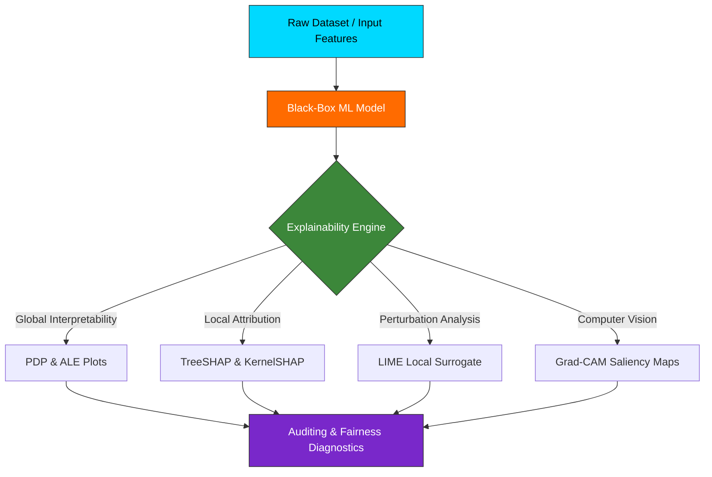

# Architecture & Technical Design 🏗️

This chapter outlines the engineering architecture, data pipelines, and modular subsystems of **ENIAD Explainable AI (XAI) Suite**.

---

## 🧩 Architectural Blueprint

---

## ⚙️ Design Principles

1. **Modularity**: Each laboratory exercise is isolated and self-contained with minimal external side-effects.
2. **Reproducibility**: Clear seed parameters, deterministic executions, and explicit environment manifests.
3. **Academic Rigor**: High adherence to theoretical foundations combined with production-grade engineering practices.
