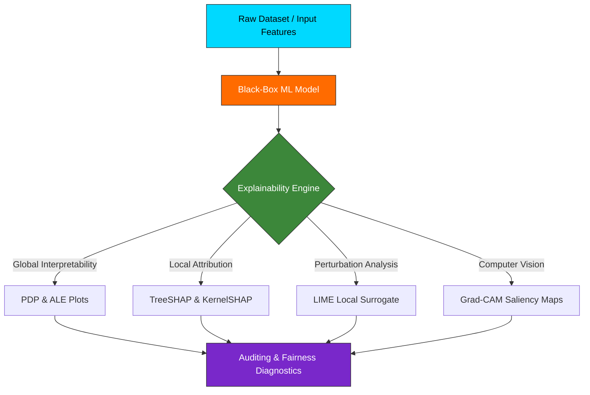

# Welcome to the ENIAD Explainable AI (XAI) Suite Documentation Wiki 📖

Welcome to the official technical documentation and engineering reference for **ENIAD Explainable AI (XAI) Suite**.

---

## 🎯 Academic & Technical Mission

Engineering Suite for Machine Learning Model Interpretability: PDP, ALE, KernelSHAP, TreeSHAP, LIME and Grad-CAM Saliency Maps.

Developed within the **State Engineering Degree in Artificial Intelligence & Digital Systems** at the **École Nationale d'Intelligence Artificielle et du Digital (ENIAD)**, Berkane, Morocco.

---

## 📚 Wiki Documentation Chapters

| Chapter | Description | Primary Topics |
| :--- | :--- | :--- |
| **[[Architecture]]** | Deep architectural design & component topology | Mermaid diagrams, component interactions, runtime environment |
| **[[Getting-Started]]** | Developer setup & workstation configuration | Prerequisites, toolchain setup, execution commands |
| **[[Curriculum-Guide]]** | Detailed syllabus and laboratory breakdown | Lab objectives, expected outputs, deliverables |

---

## 🏛️ System Architecture Snapshot

---

## 🔬 Key Methodologies Detailed

### 1. Partial Dependence Plots (PDP)
Partial dependence plots show the marginal effect one or two features have on the predicted outcome of a machine learning model. A partial dependence plot can show whether the relationship between the target and a feature is linear, monotonic or more complex.

### 2. Accumulated Local Effects (ALE)
ALE plots describe how features influence the prediction of a machine learning model on average. ALE plots are faster and unbiased alternatives to partial dependence plots (PDPs) when features are correlated.

### 3. SHAP (SHapley Additive exPlanations)
SHAP explains the prediction of an instance $x$ by computing the contribution of each feature to the prediction using coalitional game theory.

### 4. LIME (Local Interpretable Model-agnostic Explanations)
LIME explains individual predictions by approximating black-box models locally with an interpretable surrogate model (such as a sparse linear regression or decision tree).

---

*Maintained with ❤️ by [Oussama EL HADJI](https://github.com/Bosaj) • ENIAD Berkane*
